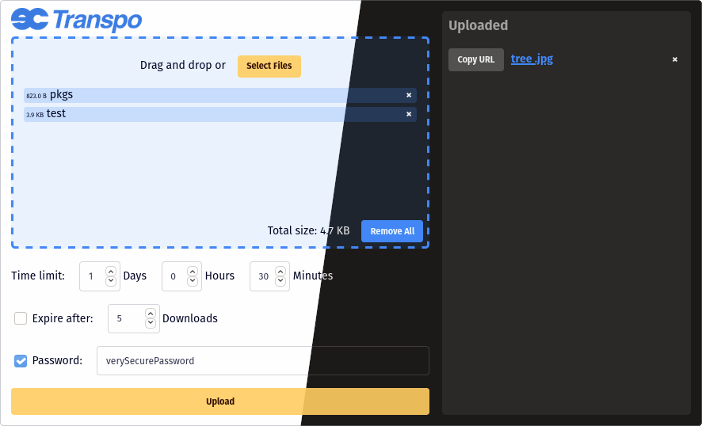

# transpo
A simple file sharing web application that is <b><s>a complete ripoff of</s></b> inspired by the late 
[Firefox Send](https://github.com/mozilla/send) which I miss very dearly.



## Features:
* Upload files that will last for a given amount of time
* Option to limit the number of times a file can be downloaded before it expires
* Option to password protect files
* Compresses multi-file uploads
* Client-side encryption and decryption of files

## Planned:
* Togglable dark theme
* Better error messages for the client

## Installation and Setup:
1) Make sure you have cargo installed.
2) Clone this repository and navigate to its directory.
3) Adjust the settings in `src/config.rs` to your liking.
4) Build with `cargo build --release` and run with `cargo run --release`.
5) After getting it to work, you should probably set up your OS's init system to run transpo as a service.

Example Nginx config for transpo running on port 8080:
```nginx
location /transpo/ {
  client_max_body_size 500M;
  proxy_pass http://127.0.0.1:8080/;
  proxy_http_version 1.1;
  proxy_set_header Upgrade $http_upgrade;
  proxy_set_header Connection "upgrade";
}

map $http_upgrade {
        default upgrade;
        '' close;
}
```
